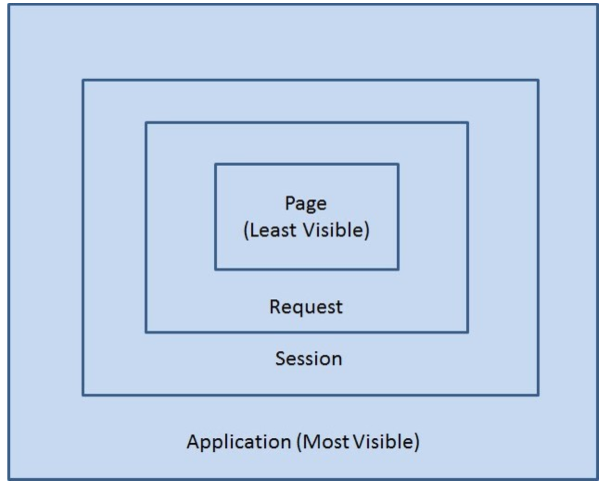
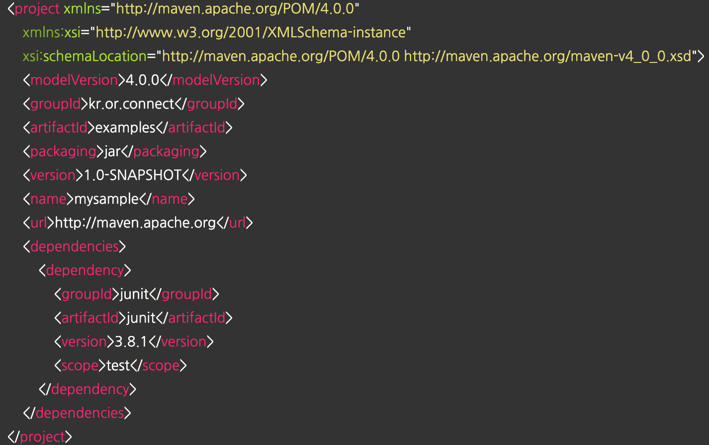
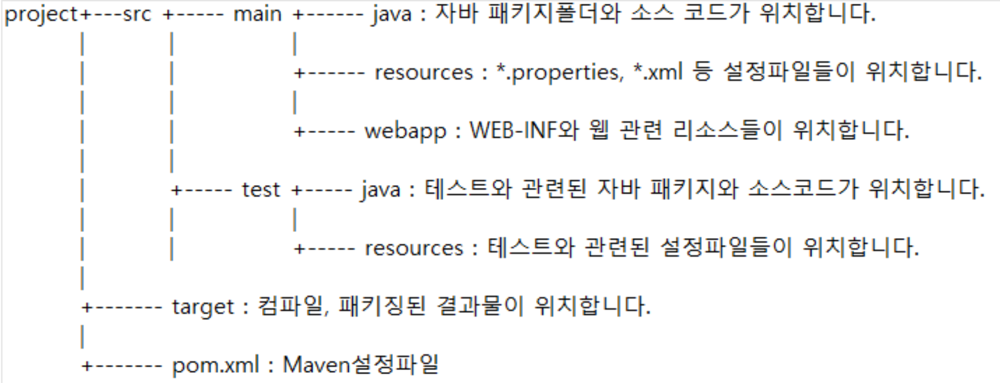
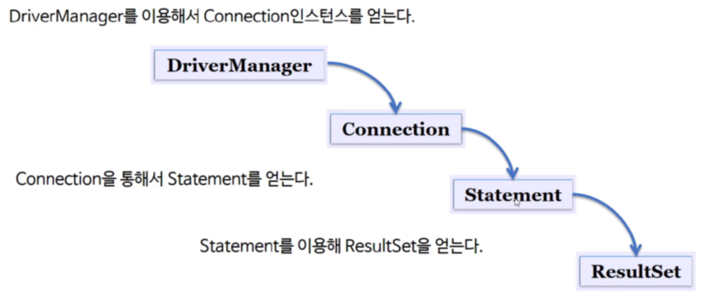

# 부스트코스 - 웹 프로그래밍(FullStack)

# FrontEnd


# BackEnd


## Part 1


## Part 2

- JSP
- Sevlet
- Scope
- JSTL&EL
- MySQL
- SQL
- Maven
- JDBC
- WEB API


## Servlet

### 1. redirect

###2. forward

### 3. servlet & jsp 연동


## Scope

### 1. scope란?


### 2. page scope

- 페이지 내에서 지역변수처럼 사용
- PageContext 추상 클래스를 사용한다.
- JSP 페이지에서 pageContext라는 내장 객체로 사용 가능 하다.
- forward가 될 경우 해당 Page scope에 지정된 변수는 사용할 수 없다.
- 사용방법은 Application scope나 Session scope, request scope와 같다.
- 마치 지역변수처럼 사용된다는 것이 다른 Scope들과 다릅니다.
- jsp에서 pageScope에 값을 저장한 후 해당 값을 EL표기법 등에서 사용할 때 사용됩니다.
- 지역 변수처럼 해당 jsp나 서블릿이 실행되는 동안에만 정보를 유지하고자 할 때 사용됩니다.

### 3. request scope

- http 요청을 WAS가 받아서 웹 브라우저에서 응답할 때까지 변수가 유지되는 경우 사용
- http 요청을 WAS가 받아서 웹 브라우저에게 응답할 때까지 변수값을 유지하고자 할 경우 사용한다.
- HttpServletRequest 객체를 사용한다.
- JSP에서는 request 내장 변수를 사용한다.
- 서블릿에서는 HttpServletRequest 객체를 사용한다.
- 값을 저장할 때는 request 객체의 setAttribute()메소드를 사용한다.
- 값을 읽어 들일 때는 request 객체의 getAttribute()메소드를 사용한다.
- forward 시 값을 유지하고자 사용한다.
- 앞에서 forward에 대하여 배울 때 forward 하기 전에 request 객체의 setAttribute() 메소드로 값을 설정한 후, 서블릿이나 jsp에게 결과를 전달하여 값을 출력하도록 하였는데 이렇게 포워드 되는 동안 값이 유지되는 것이 Request scope를 이용했다고 합니다.

### 4. session scope

- 웹 브라우저별로 변수가 관리되는 경우 사용

- 웹 브라우저별로 변수를 관리하고자 할 경우 사용한다.

- 웹 브라우저간의 탭 간에는 세션정보가 공유되기 때문에, 각각의 탭에서는 같은 세션정보를 사용할 수 있다.

- HttpSession 인터페이스를 구현한 객체를 사용한다.

- JSP에서는 session 내장 변수를 사용한다.

- 서블릿에서는 HttpServletRequest의 getSession()메소드를 이용하여 session 객체를 얻는다.

- 값을 저장할 때는 session 객체의 setAttribute()메소드를 사용한다.

- 값을 읽어 들일 때는 session 객체의 getAttribute()메소드를 사용한다.

- 장바구니처럼 사용자별로 유지가 되어야 할 정보가 있을 때 사용한다.

  

### 5. application scope

- 웹 어플리케이션이 시작되고 종료될 때까지 변수가 유지되는 경우 사용
- 웹 어플리케이션이 시작되고 종료될 때까지 변수를 사용할 수 있다.
- ServletContext 인터페이스를 구현한 객체를 사용한다.
- jsp에서는 application 내장 객체를 이용한다.
- 서블릿의 경우는 getServletContext()메소드를 이용하여 application객체를 이용한다.
- 웹 어플리케이션 하나당 하나의 application객체가 사용된다.
- 값을 저장할 때는 application객체의 setAttribute()메소드를 사용한다.
- 값을 읽어 들일 때는 application객체의 getAttribute()메소드를 사용한다.
- 모든 클라이언트가 공통으로 사용해야 할 값들이 있을 때 사용한다.




## JSTL & EL


## Maven

### 1. Maven 이란?

1. Maven 이란?

   - 애플리케이션을 개발하기 위해 반복적으로 진행해왔던 작업들을 지원하기 위한 도구
   - 빌드(Build), 패키징, 문서화, 테스트와 테스트 리포팅, git, 의존성관리, 배포등의 작업을 손쉽게 할 수 있다.

2. CoC(Convetion over Configuration) 이란?

   - 일종의 관습
   - 예) 프로그램의 소스파일은 어떤 위치에 있어야 하고, 소스가 컴파일된 파일들은 어떤 위치에 있어야 하는지에 대해 미리 정해놓는 것

3. Maven의 이점

   - 의존성 라이브러리 관리
   - 다양한 플러그인을 제공하여, 많은 일들을 자동화 시킬 수 있다.

4. pox.xml

   - project: pom.xml 파일의 최상위 root element
   - modelVersion: POM model의 버전
   - groupId: 프로젝트를 생성하는 조직의 고유 아이디를 결정, 일반적으로 도메인 이름을 거꾸로 적는다.
   - artifactId: 해당 프로젝트에 의하여 생성되는 artifact의 고유 아이디를 결정한다. 
     - Maven을 이용하여 pom.xml을 빌드할 경우 artifactId-version.packaging 같은 규칙으로 artifact가 생성된다.
   - packaging: 해당 프로젝틀 어떤 형태로 packaging 할 것인지 결정한다. jar, war, ear 등이 해당된다.
   - version: 프로젝트의 현재 버전. 
     - 개발중에는 SNAPSHOT을 접미사로 사용
     - Maven의 버전 관리 기능은 라이브러리 관리를 편하게 한다.
   - name: 프로젝트의 이름입니다.
   - url: 프로젝트 사이트가 있다면 URL을 등록할 수 있다.

   - dependencies: 의존성 관리




### 2. Maven을 이용한 웹 어플리케이션 실습


1. Maven 프로젝트 생성하기

   - File - New - Project - Maven - Maven Project
   - 아키타입(Archetype)선택
   - 아키타입(Archetype)이란? **일종의 프로젝트 템플릿, 어떤 아키타입을 선택했느냐에 따라서 자동으로, 여러 가지 파일들을 생성하거나 라이브러리를 셋팅해주는 등의 일을 함**
   - 웹 어플리케이션 개발을 위해서 maven-archetype-webapp을 선택
   - groupId, artifactId, version 등 입력
   - 프로젝트 생성 완료

   

2. Maven 프로젝트 디렉터리 구조

   - **src**
   - src/main/java: java 소스 파일
   - src/main/resources: *.properties, *.xml 등 설정파일들이 위치한다.
   - src/main/webapp: html,css 등 웹 어플리케이션과 관련된 소스
   - src/test/java: Test와 관련된 자바 패키지와 소스코드가 위치한다.
   - src/test/resources: 테스트와 관련된 설정파일들이 위치한다.
   - **target**: 컴파일, 패키징된 결과물이 위치한다.
   - **pom.xml**: Maven 설정파일

   

   

3. Maven 프로젝트 Properties 설정

   - 프로젝트 우클릭 - properties 선택
   - Java Comiler 메뉴 선택(기본적으로 JDK 1.5버전을 사용하는 것을 확인 할 수 있음)
   - JDK8을 사용하도록 Maven 설정 파일(pom.xml) 파일 수정(Buid 태그부분 새롭게 추가)

   ```xml
   <!-- Junit이 기본적으로 의존성 추가 되어 있음 -->
   <dependencies>
     <dependency>
       <groupId>junit</groupId>
       <artifactId>junit</artifactId>
       <version>3.8.1</version>
       <scope>test</scope>
     </dependency>
   </dependencies>
   <build>
       <finalName>mavenweb</finalName>
           <plugins>
           <plugin>
               <groupId>org.apache.maven.plugins</groupId>
               <artifactId>maven-compiler-plugin</artifactId>
               <version>3.6.1</version>
               <configuration>
                   <source>1.8</source>
                   <target>1.8</target>
               </configuration>
           </plugin>
       </plugins>
     </build>
   ```

   - 다시, properties 선택 후 Java EE Intergration 선택
   - Enable Project Specific Settings 체크박스 선택
   - Apply and Close 클릭
   - 위 과정은, Maven의 설정을 바꾸고, 이클립스 프로젝트 설정이 연동 되도록 하는 과정임

   

4. Maven 프로젝트에서 Servlet 라이브러리 사용하기

   - Dynamic Web Application을 만들 때는 WAS Runtime 설정 하면서 Tomcat을 지정함.
   - WAS Runtime이 지정되면 Tomcat에 있는 라이브러리를 이클립스에서 사용할 수 있다.
   - 즉, Tomcat 안에 있는 Servelt 라이브러리를 사용하게되어 문제가 안생김.
   - 하지만, Maven 프로젝트 생성시, WAS Runtime이 지정을 안 했기 때문에 서블릿 라이브러리를 찾을 수 없음
   - 그래서, dependency를 추가해야함

   ```xml
   <dependency>
       <groupId>javax.servlet</groupId>
       <artifactId>javax.servlet-api</artifactId>
       <version>3.1.0</version>
       <scope>provided</scope>
   </dependency>
   ```

   - <scope> provided라는 항목: servlet 라이브러리를 컴파일 시에만 사용되고, 배포 시에는 사용되지 않는다는 것을 의미

5. <scope> 태그
   - compile: 컴파일 할 때 필요. 테스트 및 런타임에도 classpath에 포함됨. 기본값임
   - runtime: 런타임에 필요.  컴파일 시에는 필요하지 않지만, 실행 시에는 필요한 경우.(예, JDBC 드라이브)
   - provided: 컴파일시에 필요하지만, 실제 런타임 때에는 컨테이너 같은 것에서 제공되는 모듈이라 불필요.(servlet, jsp api등이 이에 해당됨). 즉, 배포시에 제외됨.
   - test: 테스트 코드를 컴파일 할 때 필요. 테스트시 classpath에 포함되며, 배포 시 제외됨


6. 프로젝트 실행

   - Maven 프로젝트 우클릭 - Run As - Run on Server
   - Always use this server when running this project를 클릭.

   

7. JSTL 라이브러리 의존성 추가하기

   - JSTL은 Tomcat이 기본으로 제공하지 않기 때문에, 컴파일할 때도 배포할 때도 사용돼야 한다.
   - 그래서, 기본 scope 사용

   ```xml
   <dependency>
       <groupId>javax.servlet</groupId>
       <artifactId>jstl</artifactId>
       <version>1.2</version>
   </dependency>
   ```

   - 다시 Run on server를 해도 아무것도 나오지 않음
   - Maven 프로젝트 우클릭 -> properties -> Project facets 항목을 보면, 다이나믹 웹 모듈 버전 2.3을 확인 할 수 있음
   - 다이나믹 웹 모듈 2.4 부터 EL이 기본으로 사용할 수 있도록 설정 되기 때문에, 3.1 버전이 되록 설정 변경

   ```xml
   <!-- /WEB-INF/web.xml -->
   <!-- 이 설정을 -->
   <web-app>
     <display-name>Archetype Created Web Application</display-name>
   </web-app>
   
   <!-- 이 설정으로 변경 -->
   <web-app xmlns="http://xmlns.jcp.org/xml/ns/javaee" xmlns:xsi="http://www.w3.org/2001/XMLSchema-instance" 
   xsi:schemaLocation="http://xmlns.jcp.org/xml/ns/javaee http://xmlns.jcp.org/xml/ns/javaee/web-app_3_1.xsd"
   version="3.1">
     <display-name>Archetype Created Web Application</display-name>
   </web-app>
   ```

   - ./settings/org.eclipse.wst.common.project.acet.core.xml 파일을 아래와 같이 수정

   ```xml
   <?xml version="1.0" encoding="UTF-8"?>
   <faceted-project>
     <fixed facet="wst.jsdt.web"/>
     <installed facet="jst.web" version="3.1"/>
     <installed facet="wst.jsdt.web" version="1.0"/>
     <installed facet="java" version="1.8"/>
   </faceted-project>
   ```


8. 이클립스 버그로 오류가 나는 경우, 웹 어플리케이션을 깔끔하게 초기화하고 실행
   - 기존 tomcate을 종료
   - Maven 프로젝트 우클릭 -> Maven -> update project 선택
   - Servers view에서 기존 Tomcat Runtime 삭제
   - Project 메뉴의 Clean 선택
   - 프로젝트 익스플로러에서 Server 삭제
   - Run on Server 재실행


## JDBC


### 1. JDBC란?

1. JDBC(Java Database Connectivity) 개요

   - Java를 이용한 데이터베이스 접속과 SQL 문장의 살행, 그리고 결과로 얻어진 데이터의 핸들링을 제공하는 방법과 절차에 관한 규약
   - Java 프로그램 내에서 SQL문을 실행하기 위한 JAVA API
   - Java는 표준 인터페이스인 JDBC API를 제공
   - 데이터베이스 벤더 또는 서드파티에서는 JDBC 인터페이스를 구현한 드라이버(driver) 제공

   

2. JDBC 환경 구성

   - JDK 설치
   - JDBC 드라이버 설치
   - Maven에서는 당므과 같이 의존성을 추가해서 사용할 수 있다.

   ```xml
   <dependency>   
       <groupId>mysql</groupId>   
       <artifactId>mysql-connector-java</artifactId>
       <version>5.1.45</version>
   </dependency>
   ```


3. JDBC를 이용한 프로그래밍 방법

   - import java.sql.*;

   ```java
   import java.sql.*;
   ```

   - 드라이브 로드

   ```java
   Class.forName( "com.mysql.jdbc.Driver" );
   ```

   - Connection 객체 생성

   ```java
   String dburl  = "jdbc:mysql://localhost/dbName";
   Connection con =  DriverManager.getConnection ( dburl, ID, PWD );
   ```

   - Statement 객체를 생성 및 질의 수행

   ```java
   Statement stmt = con.createStatement();
   ```

   - SQL 문에 결과물이 있다면 ResultSet 객체를 생성

   ```java
   ResultSet rs =  stmt.executeQuery( "select no from user" );
   while ( rs.next() )
         System.out.println( rs.getInt( "no") );
   
   //참고
   stmt.execute(“query”); //any SQL
   stmt.executeQuery(“query”); //SELECT
   stmt.executeUpdate(“query”); //INSERT, UPDATE, DELETE
   ```

   - 모든 객체를 역순으로 닫는다.(ResultSet -> Statement -< Connetcion)

   ```java
   rs.close();
   stmt.close();
   con.close();
   ```

   

   

- 매번, 객체를 연결하고 닫는 코드가 반복적으로 발생
- 이 문제를 해결하기 위해서 Spring이 제공하는 JDBC API를 사용하여 간결하게 코드를 구성할 수 있다.


### 2. JDBC 실습

1. DTO

   - Getter/Setter/toSring 구현

   ```java
   package kr.or.connect.jdbcexam.dto;
   
   public class Role {
   	private Integer roleId;
   	private String description;
   
   	public Role() {}
   
   	public Role(Integer roleId, String description) {
   		super();
   		this.roleId = roleId;
   		this.description = description;
   	}
   
   	public Integer getRoleId() {
   		return roleId;
   	}
   
   	public void setRoleId(Integer roleId) {
   		this.roleId = roleId;
   	}
   
   	public String getDescription() {
   		return description;
   	}
   
   	public void setDescription(String description) {
   		this.description = description;
   	}
   
   	@Override
   	public String toString() {
   		return "Role [roleId=" + roleId + ", description=" + description + "]";
   	}
   }
   ```


2. DAO

   - Connection 객체 생성: 데이터베이스에 연결해서 요청/응답을 받기 위한 객체
   - PreparedStatment 객체 생성: query 사용시 ?에 값 바인딩 하는 등의 기능 제공
   - ResultSet: query의 결과, 테이블 row를 배열 형태로 받아옴
   - try/catch/finally: 에러처리

   

   - 1) 조회(getRole): 원하는 Role 객체를 테이버에스에서 가져옴

   ```java
   package kr.or.connect.jdbcexam.dao;
   
   import java.sql.Connection;
   import java.sql.DriverManager;
   import java.sql.PreparedStatement;
   import java.sql.ResultSet;
   import java.sql.SQLException;
   
   import kr.or.connect.jdbcexam.dto.Role;
   
   public class RoleDao {
   	private static String dburl = "jdbc:mysql://localhost:3306/connectdb";
   	private static String dbUser = "connectuser";
   	private static String dbpasswd = "connect123!@#";
   	
     //Role 가져오기
   	public Role getRole(Integer roleId) {
   		Role role = null;
   		Connection conn = null;
   		PreparedStatement ps = null;
   		ResultSet rs = null;
   
   		try {
   			Class.forName("com.mysql.jdbc.Driver");
   			conn = DriverManager.getConnection(dburl, dbUser, dbpasswd);
   			String sql = "SELECT description,role_id FROM role WHERE role_id = ?";
   			ps = conn.prepareStatement(sql);
   			ps.setInt(1, roleId);
   			rs = ps.executeQuery();
   
   			if (rs.next()) {
   				String description = rs.getString(1);
   				int id = rs.getInt("role_id");
   				role = new Role(id, description);
   			}
   		} catch (Exception e) {
   			e.printStackTrace();
   		} finally {
   			if (rs != null) {
   				try {
   					rs.close();
   				} catch (SQLException e) {
   					e.printStackTrace();
   				}
   			}
   			if (ps != null) {
   				try {
   					ps.close();
   				} catch (SQLException e) {
   					e.printStackTrace();
   				}
   			}
   			if (conn != null) {
   				try {
   					conn.close();
   				} catch (SQLException e) {
   					e.printStackTrace();
   				}
   			}
   		}
   
   		return role;
   	}
       
   }
   ```

   

   - 2)  입력(addRole): 원하는 Role 객체를 데이터베이스에 입력

   ```java
   //Role 입력
   public int addRole(Role role) {
   		int insertCount = 0;
   
   		try {
   			Class.forName("com.mysql.jdbc.Driver");
   		} catch (ClassNotFoundException e) {
   			e.printStackTrace();
   		}
   		String sql = "INSERT INTO role (role_id, description) VALUES ( ?, ? )";
   
   		try (Connection conn = DriverManager.getConnection(dburl, dbUser, dbpasswd);
   				PreparedStatement ps = conn.prepareStatement(sql)) {
   
   			ps.setInt(1, role.getRoleId());
   			ps.setString(2, role.getDescription());
   
   			insertCount = ps.executeUpdate();
   
   		} catch (Exception ex) {
   			ex.printStackTrace();
   		}
   		return insertCount;
   	}  
   ```

   

   - 3) 수정(updateRole): 원하는 Role 객체의 filed를 수정한다.

   ```java
   public int updateRole(Role role) {
   		int updateCount = 0;
   		
   		Connection conn = null;
   		PreparedStatement ps = null;
   		
   		try {
   			Class.forName( "com.mysql.jdbc.Driver" );
   			conn = DriverManager.getConnection ( dburl, dbUser, dbpasswd );
   			String sql = "update role set description = ? where role_id = ?";
   		
   			ps = conn.prepareStatement(sql);	
   			ps.setString(1, role.getDescription());
   			ps.setInt(2,  role.getRoleId());
   			
   			updateCount = ps.executeUpdate();
   
   		}catch(Exception ex) {
   			ex.printStackTrace();
   		}finally {
   			if(ps != null) {
   				try {
   					ps.close();
   				}catch(Exception ex) {}
   			} // if
   			
   			if(conn != null) {
   				try {
   					conn.close();
   				}catch(Exception ex) {}
   			} // if
   		} // finally
   		
   		return updateCount;
   	}
   ```

   

   - 4) 삭제(deleteRole): 원하는 Role 객체를 데이터베이스에서 삭제한다.

   ```java
   public int deleteRole(Integer roleId) {
   		int deleteCount = 0;
   		
   		Connection conn = null;
   		PreparedStatement ps = null;
   		
   		try {
   			Class.forName( "com.mysql.jdbc.Driver" );			
   			conn = DriverManager.getConnection ( dburl, dbUser, dbpasswd );			
   			String sql = "DELETE FROM role WHERE role_id = ?";
   
   			ps = conn.prepareStatement(sql);
   			ps.setInt(1,  roleId);
   			deleteCount = ps.executeUpdate();
   
   		}catch(Exception ex) {
   			ex.printStackTrace();
   		}finally {
   			if(ps != null) {
   				try {
   					ps.close();
   				}catch(Exception ex) {}
   			} // if
   			
   			if(conn != null) {
   				try {
   					conn.close();
   				}catch(Exception ex) {}
   			} // if
   		} // finally
   
   		return deleteCount;
   	}
   ```

   

   - 5) 여러개 조회(getRoles): 원하는 조건의 Role 객체를 여러개 가져온다.

   ```java
   public List<Role> getRoles() {
   		List<Role> list = new ArrayList<>();
   
   		try {
   			Class.forName("com.mysql.jdbc.Driver");
   		} catch (ClassNotFoundException e) {
   			e.printStackTrace();
   		}
   
   		String sql = "SELECT description, role_id FROM role order by role_id desc";
   		try (Connection conn = DriverManager.getConnection(dburl, dbUser, dbpasswd);
   				PreparedStatement ps = conn.prepareStatement(sql)) {
   
   			try (ResultSet rs = ps.executeQuery()) {
   
   				while (rs.next()) {
   					String description = rs.getString(1);
   					int id = rs.getInt("role_id");
   					Role role = new Role(id, description);
   					list.add(role); // list에 반복할때마다 Role인스턴스를 생성하여 list에 추가한다.
   				}
   			} catch (Exception e) {
   				e.printStackTrace();
   			}
   		} catch (Exception ex) {
   			ex.printStackTrace();
   		}
   		return list;
   	}
   ```

   

## WEB API


- API란

  - Application Programming Interface의 약자
  - 응용 프로그램에서 사용할 수 있도록, 운영체제나 프로그램밍 언어가 제공하는 기능을 제어할 수 있게 만든 인터페이스
  - 파일 제어, 창 제어, 화상 처리, 문자 제어 등을 위한 인테퍼이스

  

### 1. Rest API란?

- 클라이언트(브라우저, 모바일 앱 등)에게 정보를 제공하는 방식을 하나로 일원화
- HTTP 프로토콜로 제공하는 API
- Representational State Transfer
- 핵심 컨텐츠 및 기능을 외부 사이트에서 사용할 수 있도록 제공되는 인터페이스
- 구글 지도, 우체국 우편번호 조회, 네비어 블로그 글 저장 등
- **REST Style(규칙)**
  - client-server
  - stateless
  - cache
  - uniform interface
  - layered system
  - code-on-demand(optional)
- HTTP 프로토콜을 사용하면 uniform interface를 제외하고는 모두 쉽게 구현 가능
- uniform interface 스타일
  - 리소스가 URI로 식별되야 한다.
  - 리소스를 생성, 수정, 추가하고자 할 때 HTTP 메시지에 표현을 해서 전송해야 한다.
  - 메시지는 스스로 설명할 수 있어야 한다.(Self-descriptive message)
  - 어플리케이션의 상태는 Hyperlink를 이용해 전이되야 한다.(HATEOAS)
- REST API는 쉽지 않다. 그래서, 보통은 Web API(혹은 HTTP API)를 사용한다.
  - REST의 모든 것을 제공하지 않으면서 REST API라고 말하는 경우도 있따.
  - REST의 모든 것을 제공하지 않고, Web API(HTTP API)라고 부르는 경우가 있다.


### 2. Web API란?

1. URI는 정보의 자원을 표현해야 한다.

   - GET /members/delete/1 (X)

   - GET /members (O)

     

2. 자원에 대한 행위는 HTTP Method(GET, POST, PUT, PATCH, DELETE)로 표현해야 한다.

   - GET: 자원 가져오기
   - POST: 자원 생성
   - PUT: 자원 수정
   - DELETE: 자원 삭제

3. 슬래시 구분자(/)는 계층을 나타날 때 사용
   - ```http://domain/houses/apartments```
   - ```http://domain/departments/1/employees```
   - URI 마지막 문자로 슬래시 구분자(/)를 포함하지 않습니다.
   - 하이픈(-)은 URI가독성을 높일 때 사용합니다.
   - 언더바(_)는 사용하지 않습니다.
   - URI경로는 소문자만 사용합니다.
   - RFC 3986(URI 문법 형식)은 URI스키마와 호스트를 제외하고는 대소문자를 구별합니다.
   - 파일 확장자는 URI에 포함하지 않습니다.
   - Accept Header를 사용합니다.
4. 상태코드
   - 200: 클라이언트 요청 성공
   - 400: 클라이언트로 인한 오류
   - 500: 서버로 인한 오류


### 3. Web API 실습

1. 의존성 추가

```xml
<properties>
  <!-- web.xml 파일을 삭제해도 eclipse에서 오류가 발생하지 않는다. -->
  <failOnMissingWebXml>false</failOnMissingWebXml>
</properties>
<dependencies>
  <!-- jdbc -->
  <dependency>
    <groupId>mysql</groupId>
    <artifactId>mysql-connector-java</artifactId>
    <version>5.1.45</version>
  </dependency>

  <!-- json 라이브러리 databind jackson-core, jackson-annotaion에 의존성이 있다. -->
  <dependency>
    <groupId>com.fasterxml.jackson.core</groupId>
    <artifactId>jackson-databind</artifactId>
    <version>2.9.4</version>
  </dependency>
	
  <!-- servlet -->
  <dependency>
    <groupId>javax.servlet</groupId>
    <artifactId>javax.servlet-api</artifactId>
    <version>3.1.0</version>
    <scope>provided</scope>
  </dependency>
	
  <!-- jstl -->
  <dependency>
    <groupId>javax.servlet</groupId>
    <artifactId>jstl</artifactId>
    <version>1.2</version>
  </dependency>
	
  <!-- junit -->
  <dependency>
    <groupId>junit</groupId>
    <artifactId>junit</artifactId>
    <version>3.8.1</version>
    <scope>test</scope>
  </dependency>
</dependencies>

<!-- maven builder -->
<build>
  <finalName>webapiexam</finalName>
  <plugins>
    <plugin>
      <groupId>org.apache.maven.plugins</groupId>
      <artifactId>maven-compiler-plugin</artifactId>
      <version>3.6.1</version>
      <configuration>
        <source>1.8</source>
        <target>1.8</target>
      </configuration>
    </plugin>
  </plugins>
</build>
```

2. RoleServlet.java

```java
package kr.or.connect.webapiexam.api;

@WebServlet("/roles")
public class RolesServlet extends HttpServlet {
	private static final long serialVersionUID = 1L;

	public RolesServlet() {
		super();
	}

	protected void doGet(HttpServletRequest request, HttpServletResponse response)
			throws ServletException, IOException {
		response.setCharacterEncoding("utf-8");
		response.setContentType("application/json");

		RoleDao dao = new RoleDao();

		List<Role> list = dao.getRoles();

		ObjectMapper objectMapper = new ObjectMapper();
		String json = objectMapper.writeValueAsString(list);

		PrintWriter out = response.getWriter();
		out.println(json);
		out.close();
	}

}
```


